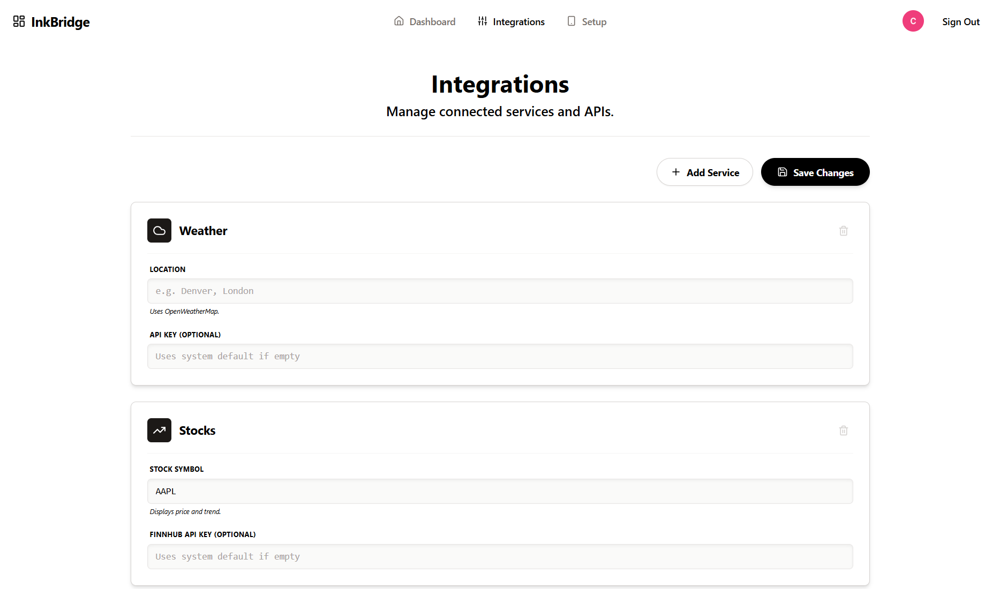
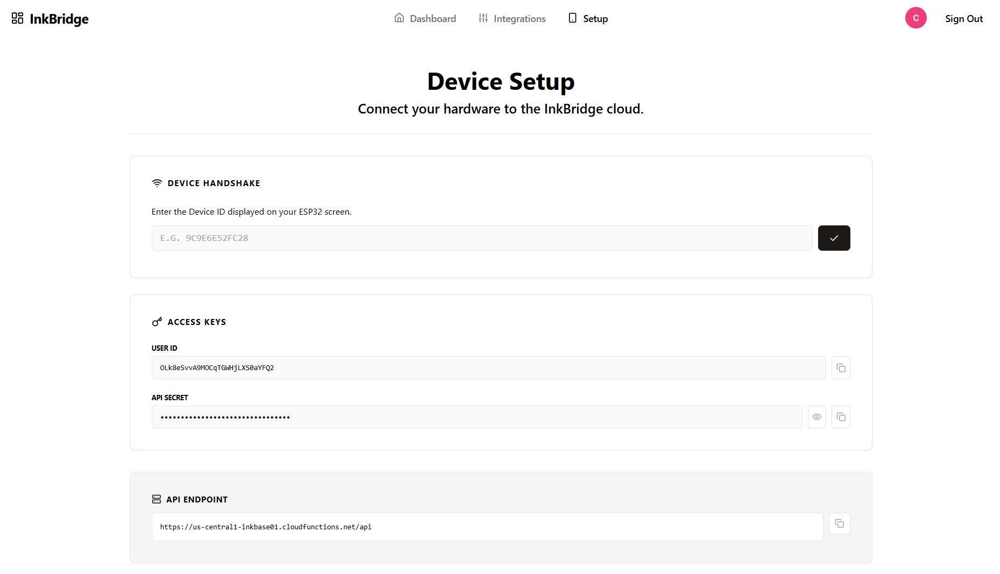

# [InkBridge](https://inkbase01.web.app)

  
  
  
  
___

# InkBridge Technical Overview

InkBridge is a full-stack IoT solution designed to drive ESP32-based displays or other IOT enabled devices. It utilizes a centralized controller pattern where the "heavy lifting" (API authentication, and data aggregation) is offloaded to the cloud to minimize the processing requirements of the low-power client. While designed for low-power clients like E-Ink displays, Inkbase functions to drive any internet enabled device given an API and the capability to make web requests.

## System Architecture

- **Frontend (React)**: A web-based control panel for device linking, service configuration, and status monitoring.
- **Backend (Node.js/Firebase)**: A serverless API that aggregates data from 3rd party APIs, and handles Spotify OAuth authentication.
- **Device (ESP32)(IOT Web Enabled Device)**: An embedded client that polls the backend for live data. 

## Backend Analysis

The backend is built using Firebase Functions and Express. It serves as the bridge between the physical device and web services. The primary logic resides in `index.js`.

### Core Modules
**Data Providers:**
- **Live Data**: Time, Spotify, Calendar, Canvas LMS, Weather (Current, Forecast, History), Astronomy, Stock (Quote, History), Crypto (Quote, History), Travel, News.

**Spotify Integration**: Implements the OAuth 2.0 Authorization Code Flow. It automatically handles token refreshing if the access token is expired before fetching playback state.

### API Endpoints

| Endpoint | Method | Description |
|----------|--------|-------------|
| `/setup` | GET | Handles the initial handshake. Receives a physical `device_id` and returns an API Key associated with the user account. |
| `/spotify/login` | GET | Initiates the OAuth login flow, redirecting the user to Spotify. |
| `/spotify/callback` | GET | Handles the OAuth callback, exchanges the code for tokens, and saves them to Firestore. |
| `/spotify/request` | POST | Proxies authenticated requests to the Spotify Web API (e.g., current playback). |
| `/spotify/user_albums` | POST | Fetches user's saved albums. Optional params: `limit`, `offset`. |
| `/spotify/user_playlists` | POST | Fetches user's playlists. Optional params: `limit`, `offset`. |
| `/spotify/liked_songs` | POST | Fetches user's liked songs. Optional params: `limit`, `offset`. |
| `/spotify/followed_artists` | POST | Fetches user's followed artists. Optional params: `limit`, `after`. |
| `/spotify/playback` | POST | Controls playback state. Required param: `action` (play, pause, next, previous, seek, volume, shuffle, repeat, transfer). |
| `/spotify/devices` | POST | Fetches available Spotify Connect devices. |
| `/calendar` | POST | Fetches and parses the user's iCal feed. Optional params: `range`, `url`. |
| `/canvas` | POST | Proxies requests to the Canvas LMS API. Optional params: `type`, `domain`, `token`. |
| `/weather` | POST | Fetches current weather conditions. Optional params: `location`. |
| `/weather/forecast` | POST | Fetches weather forecast. Optional params: `location`, `days`. |
| `/weather/history` | POST | Fetches historical weather data. Optional params: `location`, `date`. |
| `/astronomy` | POST | Fetches astronomical data (sunrise, sunset, moon phase). Optional params: `location`. |
| `/stock` | POST | Fetches real-time stock quotes. Optional params: `symbol`. |
| `/stock/array` | POST | Fetches historical stock candle data. Optional params: `symbol`, `days`. |
| `/crypto` | POST | Fetches real-time cryptocurrency quotes. Optional params: `symbol`. |
| `/crypto/array` | POST | Fetches historical cryptocurrency price data. Optional params: `symbol`, `days`. |
| `/travel` | POST | Fetches travel time and distance. Optional params: `origin`, `destination`, `mode`. |
| `/news` | POST | Fetches top headlines. Optional params: `category`. |

## Frontend Analysis

The frontend is a React application (`App.tsx`) initialized with Firebase. It uses `lucide-react` for iconography and manages state for a smooth single-page application (SPA) experience.

### Key Components

**InkBridge (Main)**: Manages the application lifecycle, including Authentication (Google Sign-In) and View Routing.

**Dashboard View**: Visualizes the "live" device status. Displays currently enabled integrations.

**Setup View**: Provides the interface to link a physical device. It generates API Secrets (`sk_...`) and provides a firmware logic snippet for the user.

**Integrations View**: A configuration hub where users enable services and input credentials (API keys, cities, iCal URLs).

### Data Management

Data is stored in Firestore with the following structure:

| Collection Path | Purpose |
|----------------|---------|
| `artifacts/{APP_ID}/users/{uid}/settings/integrations` | Stores user configuration (weather cities, API keys, OAuth tokens). |
| `artifacts/{APP_ID}/devices/{deviceId}` | Maps physical hardware MAC addresses to user accounts. |

## Key Mechanisms

### Spotify OAuth Flow

The application implements a full server-side OAuth flow:

1. **Trigger**: User clicks "Connect Spotify" in the Frontend.
2. **Redirect**: Backend constructs the authorization URL with state (User UID) and redirects to Spotify.
3. **Callback**: Spotify calls the backend with a code.
4. **Storage**: Backend exchanges code for Access/Refresh tokens and stores them securely in Firestore.

## TO-DO
### Backend Development (Node JS)

### Frontend Development (Typescript)

